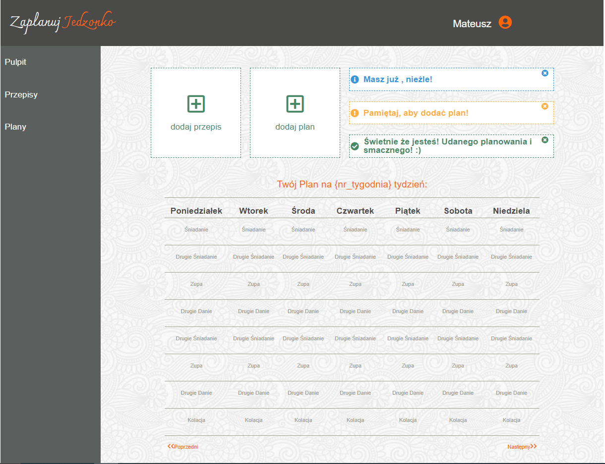

# Schedule Your Meal Application

## Table of contents
* [General info](#general-info)
* [Screenshots](#screenshots)
* [Technologies](#technologies)
* [Setup](#setup)
* [Features](#features)
* [Status](#status)
* [Participants](#participants)
* [Inspiration](#inspiration)
* [Contact](#contact)

## General info
It's a simple application for planning dinner schedule. You can add your recipes and make a weekly meal`s plan. Everything is saved in Local Storage so 
you can always come back to your meals and plans, change them and use whenever you want.

This was a Project dedicated to ScrumLab front-end project in CodersLab. Our Project Team made this project in one Sprint (1 week).   
It was a final Project in Scrum Workshop. That was great simulation of working in Scrum. It gave me a lot of experience.

Especially in:
 1. Working in Scrum
 2. Using Local Storage
 3. Using Sass with Gulp Tool

## Screenshots
###Home Page

###Application View

### Plans View

###Adding New Plan View

### Recipes View

###Adding New Recipes View

## Technologies
* HTML - version 5.0
* CSS - version 4.0
* Sass -  with Gulp Tool
* Save data in Local Storage
* Vanilla JavaScript 
## Setup

How to start:

To start development follow this instruction:

* `clone` this repo
* `npm install` all necessary npm packages

Gulp usage:
Available commends for you to type in console:

`npm run watch` - runs gulp in watch mode, that will compiles your `main.scss` into `css/main.css` and run the server.

`gulp` or `gulp serve`  - this will run gulp in browserSync mode, that means gulp will start serwer on your `localhost` and refresh it for you everytime you change `scss`, `js` or `html` file. Using this command will do all the work for you :)

`gulp sass` - compiles sass into CSS & auto-inject into browsers

## Features
List of features ready and TODOs for future development
* Name validation and save in Local Storage 
* Adding Recipes and Plans
* Changing Plans and Recipes
* Widget with Recipes counter

To-do list:
* Schedule display in Application View

## Status
Project is: _in progress_, 

## Participants
 * [Agata Urbanska](https://github.com/agataurbanska9) 
 * [Patryk Urbanski](https://github.com/PatrykUrbanski) 
 * [Jakub Statuch](https://github.com/JakubStatuch) 
 * [Mateusz Kusmierczyk](https://github.com/mkusmierczyk)

## Inspiration
Project inspired based on CodersLab guidelines. 

## Contact
Created by Mateusz Kusmierczyk. Feel free to contact me!

